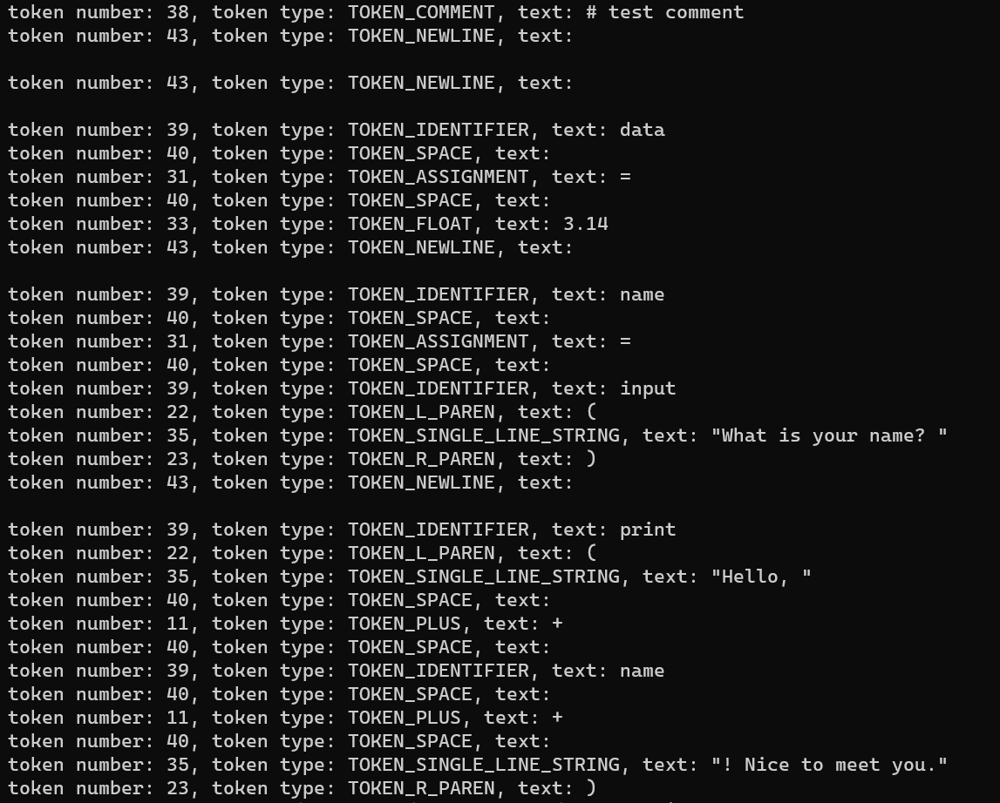

# Scanner for Python

2023 Spring Semester Compiler Design Lecture Project

## Description

1. Describe the specifications of a programming language 
    * You can either define a completely new PL
        * At least, there should be keywords, identifiers, comments, conditions, loops, and operations
        * You will use this for the 2nd and 3rd projects
    * Or use a minimal version of The Go Programming Language or another language that is not C, C++, and Java
        * At least, there should be common keywords, identifiers, comments, conditions, loops, and operations

2. Using Flex, write a scanner for the language you described in 1: it should be able to read in source on the input and should output token types (as in the last example in the lecture). Test it out by applying it to different source files you have created.

## Test Scanner

For the following code:
```python
# test comment

data = 3.14
name = input("What is your name? ")
print("Hello, " + name + "! Nice to meet you.")
```

Scanner gives:


